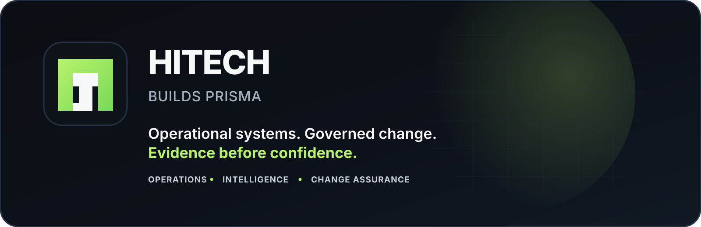
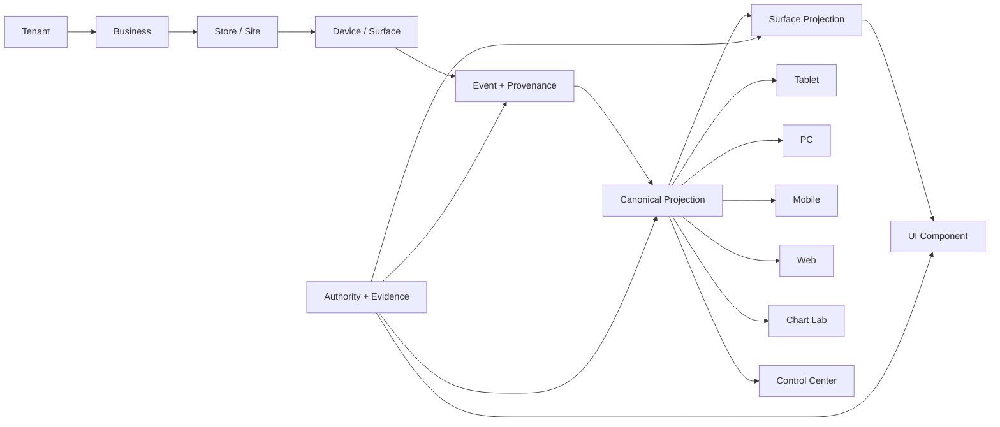

<p align="center">
  
</p>

<p align="center">
  <strong>Operational software for real businesses, governed like infrastructure.</strong><br/>
  Commerce · Operations · Intelligence · Change Assurance
</p>

<p align="center">
  <a href="#prisma-at-a-glance">PRISMA</a> ·
  <a href="#architecture">Architecture</a> ·
  <a href="#change-assurance">Change Assurance</a> ·
  <a href="#authority-mesh--automesh-v2">Authority Mesh</a> ·
  <a href="#engineering-doctrine">Engineering Doctrine</a> ·
  <a href="#quick-start">Quick Start</a>
</p>

---

# HITECH OS

**HITECH OS** is the engineering platform where **HITECH** builds **PRISMA**, a governed multi-surface operational system for point of sale, backoffice control, inventory, purchasing, analytics, licensing, visual governance, evidence, and software change assurance.

PRISMA does not treat a screen as the source of truth. A screen is the final projection of a deeper operational model:

```text
TENANT → BUSINESS → STORE / SITE → DEVICE / SURFACE → EVENT + PROVENANCE
       → CANONICAL PROJECTION → SURFACE PROJECTION → UI COMPONENT
```

> **No evidence. No green.**

## PRISMA at a glance

| System | What it does |
|---|---|
| **PRISMA Tablet Core** | Point of sale, catalog, checkout, stock, shifts, returns, sales and sync |
| **PRISMA PC Backoffice** | Inventory, purchasing, receiving, sales control, audit, devices, licensing and executive operations |
| **PRISMA Mobile** | Bounded mobile companion workflows and operational projections |
| **PRISMA Web / Edit** | Governed web-facing and editing experiences |
| **PRISMA Chart Lab** | Operational analytics, chart experimentation and recipe-driven visualization |
| **PRISMA Control Center** | Local operations, diagnostics, evidence and governance workflows |
| **Shared UI / Quality Tooling** | Cross-surface contracts, visual certainty, quality gates and governed infrastructure |

Canonical route, port, owner, panel and allowed-scope truth lives in [`apps/terminal-de-venta-system/.prisma-ui/surfaces.json`](apps/terminal-de-venta-system/.prisma-ui/surfaces.json). This README intentionally avoids duplicating fast-changing runtime registries.

## Architecture



This is the foundation of the **Neutral Data Center / NDC Matrix Substrate**. Neutral meaning comes first. Surface-specific representation comes later.

Read the canon: [`apps/terminal-de-venta-system/docs/ndc/00_NDC_README.md`](apps/terminal-de-venta-system/docs/ndc/00_NDC_README.md)

## Three pillars

### 01 · Operations

PRISMA connects real business workflows across multiple surfaces without collapsing their ownership boundaries. Tablet, PC, Mobile, Web, Chart Lab and Control Center may project the same canonical truth, but they remain distinct governed surfaces.

### 02 · Intelligence

NDC gives tenants, businesses, stores, devices, users, licenses, events, actions, evidence and canonical projections neutral identity and provenance. The objective is not “more dashboards.” It is explainable operational truth.

### 03 · Change Assurance

PRISMA treats software change itself as a governed operational process. Before a change is called done, the system should know the target, authority, protected boundaries, potential impact and evidence required to prove the result.

## Change Assurance

**PRISMA Change Assurance** is the governed change-control product built on the **Code Atlas** engine.

> **Know what can change. Control what does. Prove the result.**

Its six governed stages are:

```text
UNDERSTAND → RESOLVE → AUTHORIZE → OBSERVE → VERIFY → PROVE
```

It is designed to answer questions coding agents alone cannot safely answer by confidence or retrieval:

- What actually exists?
- What is the exact target?
- What may change?
- What must remain untouched?
- What could be affected?
- Which evidence is required?
- Can this result legitimately be called complete?

Canonical product contract: [`tools/code-atlas/docs/PRISMA_CHANGE_ASSURANCE_V1.md`](tools/code-atlas/docs/PRISMA_CHANGE_ASSURANCE_V1.md)

## Authority Mesh / AutoMesh v2

PRISMA uses **Authority Mesh** to decide which repository truth governs a task before mutation. The current GitHub-first operator flow is **AutoMesh v2**.

The central rule is:

> **`main` moving triggers relevant-drift evaluation, not unconditional authority destruction.**

If canonical `main` changes after a valid task-exact Mesh, the operator must revalidate the prior artifact against the new HEAD. Same-head authority can reuse validated bytes; unrelated drift can be rebound to current HEAD with a new attestation; relevant or non-ancestor drift requires a full fresh Mesh; invalid/unprovable prior evidence fails closed.

```text
/prisma-automesh task <urlsafe-base64-request-without-padding>
/prisma-automesh revalidate <artifact-id> sha256:<artifact-digest>
```

The v2 path also preserves these boundaries:

- `CANDIDATE` retrieval is not authority;
- the AutoMesh/revalidation workflows and other governance sources can be trust anchors;
- visual work requires governed surface Mesh + Layer Map evidence;
- selected-file evidence is bound to certified Git blob identity so Windows CRLF does not create false drift;
- contradictory identity evidence fails closed;
- revalidated GitHub artifacts can chain only when digest/report/HEAD evidence verifies;
- independent read-only revalidations can run concurrently without forcing every task into one global queue;
- CI, AutoMesh and revalidation success do not imply production certification.

Canonical operator runbook: [`apps/terminal-de-venta-system/docs/ops/PRISMA_AUTHORITY_MESH_AUTOMESH_V2_RUNBOOK.md`](apps/terminal-de-venta-system/docs/ops/PRISMA_AUTHORITY_MESH_AUTOMESH_V2_RUNBOOK.md)

Operational documentation index: [`apps/terminal-de-venta-system/docs/ops/README.md`](apps/terminal-de-venta-system/docs/ops/README.md)

## Factory Ledger

Repository prose is not maturity truth.

Capability state, evidence, next gates and do-not-rebuild rules are governed by the [`PRISMA Factory Ledger`](PRISMA%20Factory%20Ledger/PRISMA_FACTORY_LEDGER.json).

If this README and the Factory Ledger disagree, **the Factory Ledger wins**.

That distinction is deliberate. Source code existence does not automatically prove runtime behavior, production readiness, hosted readiness, commercial readiness or universal stack coverage.

## Engineering doctrine

HITECH OS favors explicit authority over optimistic inference.

1. **No evidence. No green.** Missing proof stays missing.
2. **Candidate != Authority.** Discovery does not grant permission.
3. **Impact Radius != Authorization.** Knowing what may break does not authorize touching it.
4. **Retrieval != Proof.** Finding a file or fact is not proof of a claim.
5. **UNKNOWN is valid.** Unsupported certainty is worse than an explicit unknown.
6. **Neutral scope before screen truth.** Tenant, business, store, device, event and provenance come before UI.
7. **Surface boundaries matter.** A feature on one surface does not grant mutation authority over another.
8. **Rollback and evidence belong with the change.** Recovery and proof are part of completion.
9. **Secrets and customer data require explicit boundaries.** Diagnostic convenience never outranks custody.
10. **Do not rebuild proven capability.** Anti-rework is a first-class engineering constraint.
11. **Parallelism follows real overlap.** A different `main` SHA is a signal to evaluate drift, not proof that every task must restart.

## Repository map

```text
hitech-os/
├─ apps/
│  ├─ terminal-de-venta-system/   # PRISMA operational product ecosystem
│  └─ keystone/                   # visual / scene / proof tooling
├─ packages/                      # shared packages and contracts
├─ services/                      # service layer
├─ tools/
│  ├─ code-atlas/                 # PRISMA Change Assurance engine
│  └─ ...                         # health, governance and repository tooling
├─ prisma-html/                   # governed visual authority / UI assets
├─ PRISMA Factory Ledger/         # capability truth, evidence and anti-rework
├─ docs/                          # repository-level documentation
└─ README.md
```

The repository is intentionally evidence-heavy. Contracts, validators, manifests, evidence indexes and verification tooling are part of the architecture, not paperwork added after the fact.

## Quick start

### Requirements

```text
Node.js  >= 20 and < 26
pnpm     >= 9 and < 10
```

### Install

```bash
pnpm install --frozen-lockfile
```

### Core repository health

```bash
pnpm run health
pnpm run workspace:validate
pnpm run deps:check
```

### Full quality gate

```bash
pnpm run quality
```

### CI-equivalent orchestration

```bash
pnpm run ci
```

A passing aggregate command does **not** automatically prove every visual, runtime, deployment or commercial claim. PRISMA gates are claim-specific by design.

## Selected developer entrypoints

```bash
pnpm run dev:keystone
pnpm run dev:operator
pnpm run dev:forms
pnpm run dev:chart-lab

pnpm run hos:doctor
pnpm run hos:visual
pnpm run hos:simulate
pnpm run hos:hygiene

pnpm run guardrails:all
pnpm run golden:validate
```

Product-specific verification lives under `apps/terminal-de-venta-system` and includes focused gates for Tablet, PC, Mobile, Chart Lab, licensing, sync, provenance, customer safety and operational evidence.

## Start here

If you are new to the repository:

1. Read the [`PRISMA Factory Ledger Agent Gate`](PRISMA%20Factory%20Ledger/PRISMA_FACTORY_LEDGER_AGENT_GATE.md) before technical change work.
2. Read the [`Factory Ledger`](PRISMA%20Factory%20Ledger/PRISMA_FACTORY_LEDGER.json) for current capability truth.
3. Read the [`Authority Mesh / AutoMesh v2 operator runbook`](apps/terminal-de-venta-system/docs/ops/PRISMA_AUTHORITY_MESH_AUTOMESH_V2_RUNBOOK.md) before governed repository mutation or stale-authority decisions.
4. Read the [`PRISMA Field Manual`](apps/terminal-de-venta-system/docs/ops/PRISMA_FIELD_MANUAL_APRENDIZAJE_OPERATIVO.md) before operational repository work.
5. Use the [`surface registry`](apps/terminal-de-venta-system/.prisma-ui/surfaces.json) before touching UI.
6. Use the [`NDC canon`](apps/terminal-de-venta-system/docs/ndc/00_NDC_README.md) before inventing app-specific data meaning.
7. Use Change Assurance / Code Atlas when the question is not merely “where is the code?” but “what may change, what is protected, and what must be proven?”

## About HITECH

**HITECH RECTIFIERS, S.A. de C.V.** is a Mexican industrial technology company whose registered scope includes industrial maintenance, electrical and electronic systems, industrial equipment and parts, automation, industrial process support, and instrumentation and control.

HITECH OS brings that industrial mindset into software: systems should be operable, traceable, repairable, governable and able to prove what happened.

<p align="center">
  <strong>Built in Mexico. 🇲🇽</strong><br/>
  <sub>Operational systems · Governed change · Evidence before confidence</sub>
</p>
