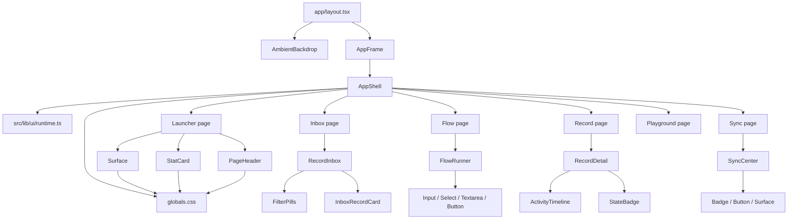

# Frontend Visual Map
**Project:** `apps/external_interaction_template`  
**Scope:** visual structure, safe edit points, and “where do I touch this without detonating the whole surface?”

## 1. Frontend truth in one breath

This app is a **Next.js App Router** surface with a global frame and a reusable visual system:

- `app/layout.tsx` mounts the global shell
- `components/layout/ambient-backdrop.tsx` paints the moving glassy backdrop
- `components/layout/app-frame.tsx` bridges pathname + accessibility into the shell
- `components/layout/app-shell.tsx` decides the current UI area and the chrome around every page
- pages under `app/` render the actual business surfaces
- `components/ui/*` gives the reusable atoms and cards
- `src/lib/ui/runtime.ts` is the visual control brain for area, density, preset, role, motion, contrast, and brand

That means most visual changes fall into **five buckets**:

1. Global shell and page chrome
2. Background and motion mood
3. Runtime visual context
4. Feature surfaces
5. Shared UI primitives

---

## 2. Frontend map

---

## 3. Safe visual edit points

## A. Global shell and chrome

### File
- `components/layout/app-shell.tsx`

### Controls
- top nav
- “current surface” summary card
- role / density / preset / motion / contrast chips
- per-area copy
- area switching by pathname

### Touch this when
- you want the header to look different
- you want different top actions
- you want new chrome, chips, or panel arrangement
- you want page personality to change by area

### High-value functions / blocks
- `resolveArea(currentPath)`
- `areaDescription(area)`
- `AppShell(...)`

### Risk
Medium. This file wraps basically every page.

---

## B. Backdrop and motion atmosphere

### File
- `components/layout/ambient-backdrop.tsx`

### Controls
- radial glows
- animated blobs
- reduced-motion behavior
- background mood

### Touch this when
- you want the app to feel calmer, shinier, darker, or less animated
- you want to reduce visual noise
- you want to tune the premium/glass feel

### Risk
Low to medium. Mostly visual, but easy to make the UI too loud.

---

## C. Runtime visual contract

### File
- `src/lib/ui/runtime.ts`

### Controls
- `area`
- `density`
- `preset`
- `role`
- `motion`
- `contrast`
- `brandProfile`

### The real power knobs
- `UI_AREAS`
- `UI_DENSITIES`
- `UI_PRESETS`
- `UI_ROLES`
- `UI_MOTION_PREFERENCES`
- `UI_CONTRAST_PREFERENCES`
- `BRAND_PROFILES`
- `createRuntimeUiContext(...)`
- `runtimeDataAttributes(...)`
- `runtimeSpacing(...)`
- `runtimeMotionClass(...)`
- `runtimeContrastClass(...)`
- `runtimeShellClass(...)`

### Touch this when
- you want visual behavior to vary by page type
- you want compact vs comfortable vs spacious tuning
- you want brand presets to change globally
- you want accessibility-aware styling changes

### Risk
Medium to high. This is the **frontend control brain**.

---

## D. Feature surfaces

### 1) Launcher
**Files**
- `app/page.tsx`
- `components/ui/page-header.tsx`
- `components/ui/stat-card.tsx`
- `components/ui/surface.tsx`

**Controls**
- hero copy
- stat tiles
- available flow cards
- CTA layout

**Touch this when**
- you want the homepage/dashboard to change

---

### 2) Inbox
**Files**
- `app/inbox/page.tsx`
- `components/records/record-inbox.tsx`
- `components/records/inbox-record-card.tsx`

**Controls**
- triage layout
- filters
- queue cards
- scan density

**Touch this when**
- you want review ergonomics to change

---

### 3) Flow runner
**Files**
- `app/flow/[schemaId]/page.tsx`
- `components/flow/flow-runner.tsx`

**Controls**
- stepper
- save/submit notices
- field rendering
- token resume UX
- progress summary
- attachment handling UI

**Touch this when**
- you want external-user form UX to change

**Important note**
This surface mixes **visual composition** and **client behavior**. Treat it carefully.

---

### 4) Record detail
**Files**
- `app/record/[recordId]/page.tsx`
- `components/records/record-detail.tsx`
- `components/records/activity-timeline.tsx`

**Controls**
- detail page layout
- timeline
- action area
- status presentation
- attachments / dispatch / sync sections

**Touch this when**
- you want operator review detail to change

---

### 5) Sync center
**Files**
- `app/sync/page.tsx`
- `components/sync/sync-center.tsx`

**Controls**
- metrics
- retry controls
- event list
- failed-job visibility
- filter pills

**Touch this when**
- you want operational visibility to change

---

### 6) Schema playground
**File**
- `app/playground/page.tsx`

**Controls**
- side-by-side schema cards
- design-system validation surface

**Touch this when**
- you want a safer place to compare schema visual differences

---

## E. Shared UI primitives

### Files
- `components/ui/button.tsx`
- `components/ui/badge.tsx`
- `components/ui/input.tsx`
- `components/ui/select.tsx`
- `components/ui/textarea.tsx`
- `components/ui/surface.tsx`
- `components/ui/page-header.tsx`
- `components/ui/stat-card.tsx`
- `components/ui/state-badge.tsx`
- `components/ui/status-panel.tsx`
- `components/ui/filter-pills.tsx`

### Touch this when
- you want a broad, systematic visual change
- the same issue appears in multiple screens
- spacing, borders, shadow, typography, or variants feel off everywhere

### Risk
High leverage. Tiny changes here ripple across the app.

---

## 4. If you want X, touch Y

| Goal | First file to touch | Second place to inspect |
|---|---|---|
| Change header / top chrome | `components/layout/app-shell.tsx` | `src/lib/ui/runtime.ts` |
| Change backdrop glow / motion | `components/layout/ambient-backdrop.tsx` | `app/globals.css` |
| Change density / contrast / preset logic | `src/lib/ui/runtime.ts` | `components/layout/app-shell.tsx` |
| Change launcher cards and stats | `app/page.tsx` | `components/ui/stat-card.tsx` |
| Change inbox review UX | `components/records/record-inbox.tsx` | `components/records/inbox-record-card.tsx` |
| Change multi-step form UX | `components/flow/flow-runner.tsx` | `app/flow/[schemaId]/page.tsx` |
| Change record detail experience | `components/records/record-detail.tsx` | `components/records/activity-timeline.tsx` |
| Change sync dashboard | `components/sync/sync-center.tsx` | `components/ui/filter-pills.tsx` |
| Change broad card styling | `components/ui/surface.tsx` | `app/globals.css` |
| Change buttons globally | `components/ui/button.tsx` | screens that use variant props |

---

## 5. Safe edit order

When changing visuals, follow this order:

1. **Copy / labels / composition props**
2. **Shared component variant**
3. **Runtime visual rules**
4. **Global shell**
5. **Global CSS**
6. **Behavior inside client components**

That order keeps the blast radius smaller.

---

## 6. Frontend danger zones

These are the places where visual edits can secretly become logic bugs:

### `components/flow/flow-runner.tsx`
Why dangerous:
- validation
- persistence
- attachment upload
- step navigation
- draft vs submit logic

### `components/sync/sync-center.tsx`
Why dangerous:
- retry button wires to backend
- filters are stateful
- refresh behavior matters

### `components/records/record-detail.tsx`
Why dangerous:
- action buttons likely reflect state availability
- audit data needs consistent ordering and visibility

### `src/lib/ui/runtime.ts`
Why dangerous:
- this changes the visual contract app-wide

---

## 7. Recommended workflow for frontend changes

### Cosmetic-only
- change feature page component first
- then shared primitive only if repetition appears

### System-wide style
- change UI primitive or runtime contract first
- then inspect launcher, inbox, flow, record, sync surfaces

### Big redesign
- prototype in `playground`
- validate `launcher`
- validate `flow`
- validate `record`
- validate `sync`

That sequence catches most ugly regressions before production.

---

## 8. Suggested file ownership map

| Layer | Files |
|---|---|
| Global frame | `app/layout.tsx`, `components/layout/app-frame.tsx`, `components/layout/app-shell.tsx` |
| Ambient mood | `components/layout/ambient-backdrop.tsx`, `app/globals.css` |
| Visual runtime contract | `src/lib/ui/runtime.ts` |
| Launcher | `app/page.tsx` |
| Inbox | `app/inbox/page.tsx`, `components/records/record-inbox.tsx` |
| Flow | `app/flow/[schemaId]/page.tsx`, `components/flow/flow-runner.tsx` |
| Record detail | `app/record/[recordId]/page.tsx`, `components/records/record-detail.tsx` |
| Sync | `app/sync/page.tsx`, `components/sync/sync-center.tsx` |
| System validation | `app/playground/page.tsx` |
| Shared atoms | `components/ui/*` |

---

## 9. Bottom line

If the question is:

- **“Where do I change the shell?”** → `app-shell.tsx`
- **“Where do I change the mood?”** → `ambient-backdrop.tsx`
- **“Where do I change density / preset / contrast?”** → `runtime.ts`
- **“Where do I change a business surface?”** → the page component + its feature component
- **“Where do I change the design system?”** → `components/ui/*`

That is the cleanest frontend map for moving fast without editing blind.
