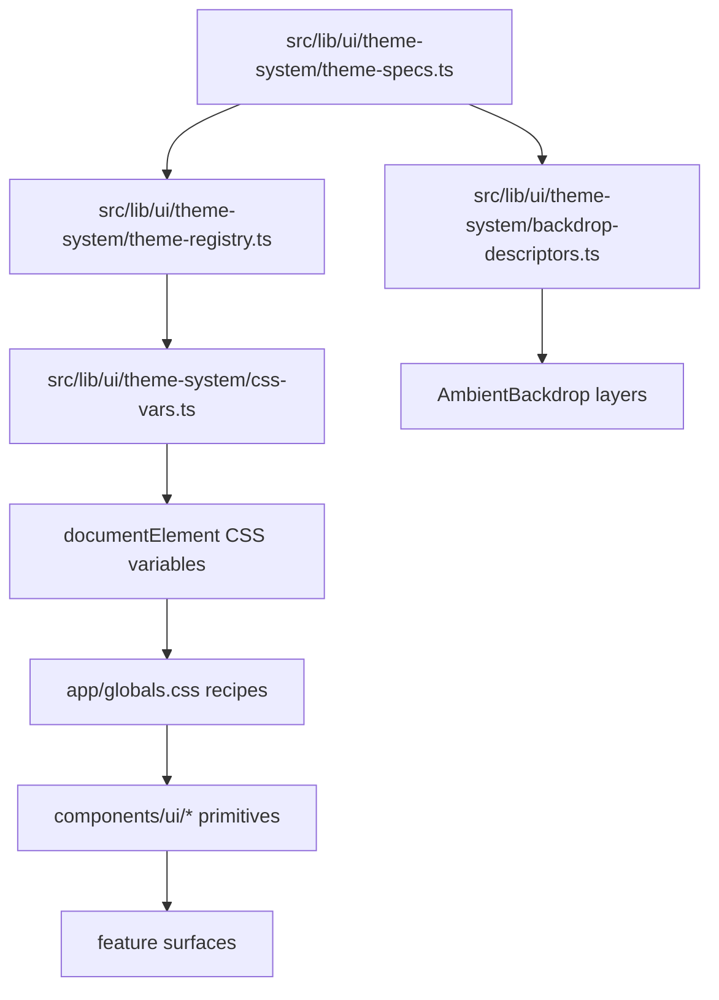

# Frontend Visual Map
**Project:** `apps/external_interaction_template`  
**Last update:** 2026-04-13

## 0. Golden Spec Priority

Visual and functional shell behavior is governed by:

1. `docs/architecture/GOLDEN_SPEC_UI_SHELL_V1.md`
2. `docs/architecture/GOLDEN_SPEC_ACCEPTANCE_MATRIX_V1.md`
3. `docs/architecture/GOLDEN_SPEC_APPROVAL_RECORD_V1.md`

If this map conflicts with the golden spec set, the golden spec set is authoritative.

## 1. Visual ownership in one pass

The app now uses a **typed theme system** with explicit boundaries:

1. `src/lib/ui/theme-system/*` owns theme identity (tokens/specs).
2. `app/globals.css` consumes tokens and exposes reusable visual recipes.
3. `components/layout/app-shell.tsx` owns chrome composition and selector wiring.
4. `components/layout/ambient-backdrop.tsx` owns deterministic atmosphere layers.
5. `src/lib/ui/runtime.ts` owns runtime context (area/density/motion/contrast), not theme appearance.

This separation prevents appearance logic from leaking into runtime/business modules.

---

## 2. Theme system map

---

## 3. Safe edit points (new)

## A. Theme identity (source of truth)

- `src/lib/ui/theme-system/theme-specs.ts`

Edit here when you need to change:

- theme palette and contrast
- materials and shell recipe
- motion cadence and hover language
- backdrop atmosphere identity
- widget family tokens
- typography and data-viz language

Do **not** put theme-specific hardcoded selectors in feature components.

## B. Selector, IDs, visibility, persistence

- `src/lib/ui/theme-system/theme-registry.ts`
- compatibility shim: `src/lib/ui/theme-catalog.ts`

Owns:

- public IDs: `aurora`, `solstice`, `neon`
- reserved IDs: `slot_01`, `slot_02`
- default theme (`solstice`)
- storage key compatibility
- selector visibility for reserved slots

Reserved slot visibility flags:

- `NEXT_PUBLIC_EIT_THEME_SLOT_01_VISIBLE`
- `NEXT_PUBLIC_EIT_THEME_SLOT_02_VISIBLE`

`"1"` shows slot in selector, anything else keeps it hidden.

## C. Token application to runtime DOM

- `src/lib/ui/theme-system/css-vars.ts`

Owns:

- mapping typed spec -> CSS custom properties
- `applyThemeToDocument(themeId)`
- `color-scheme` per theme

## D. Backdrop and motion atmosphere

- `components/layout/ambient-backdrop.tsx`
- `src/lib/ui/theme-system/backdrop-descriptors.ts`

Owns:

- layered atmosphere (base / mist / far particles / near particles / sparkles / noise / vignette)
- deterministic particle descriptors (seeded)
- cadence bands around 3s / 5s / 10s
- reduced/none motion behavior

## E. Runtime context (non-theme)

- `src/lib/ui/runtime.ts`

Owns:

- area/density/preset/role/motion/contrast selection
- data attributes and runtime utility classes

Does **not** own theme appearance anymore.

## F. Shared visual recipes

- `app/globals.css`
- `components/ui/*`

`globals.css` now provides generic classes that consume theme vars:

- surfaces: `surface-shell`, `surface-panel`, `surface-elevated`, `surface-muted`
- controls: `ui-button*`, `ui-field`, `ui-pill`, `ui-badge`
- shell: `shell-*` cluster/nav/chips
- feedback: `ui-notice*`
- ambient classes

Primitives consume these classes; feature screens should reuse primitives/surfaces.

## G. Shell orchestration and injection

- `src/lib/ui/shell-system/types.ts` defines contracts for:
  - slots
  - nav items
  - actions
  - widgets
  - modules
  - client manifests
- `src/lib/ui/shell-system/validators.ts` is the fail-fast gate for invalid payload shapes.
- `src/lib/ui/shell-system/registries/*` owns ordered validated registries.
- `src/lib/ui/shell-system/client/*` owns client-specific manifests (labels, nav/actions/widgets, permissions, icon-family binding).
- `src/lib/ui/shell-system/composeShellModel.ts` composes final shell state from:
  - runtime context
  - permissions
  - route/area
  - client registries
  and then hydrates:
  - `brandSlot`
  - `workspaceSlot`
  - `primaryNavSlot`
  - `secondaryNavSlot`
  - `quickActionSlot`
  - `contextActionSlot`
  - `utilitySlot`
  - `footerSlot`
  - `contextualPanelSlot`
  - `quickFiltersSlot`
  - `pluginTraySlot`

The shell components under `components/layout/shell/*` render only resolved slot payloads. They do not own client-specific menu truth.

---

## 4. If you want X, touch Y

| Goal | First file | Second file |
|---|---|---|
| Redefine Aurora visual identity | `src/lib/ui/theme-system/theme-specs.ts` | `app/globals.css` |
| Change default theme | `src/lib/ui/theme-system/theme-registry.ts` | `components/layout/app-shell.tsx` |
| Show/hide reserved slots | `src/lib/ui/theme-system/theme-registry.ts` | `.env` (`NEXT_PUBLIC_EIT_THEME_SLOT_*_VISIBLE`) |
| Adjust backdrop density or cadence | `src/lib/ui/theme-system/backdrop-descriptors.ts` | `components/layout/ambient-backdrop.tsx` |
| Tune shell thickness/chrome feel | `components/layout/app-shell.tsx` | `app/globals.css` (`shell-*`) |
| Change button/input family across app | `components/ui/button.tsx`, `input.tsx`, `select.tsx`, `textarea.tsx` | `app/globals.css` (`ui-*`) |
| Tune reduced motion behavior | `components/layout/ambient-backdrop.tsx` | `app/globals.css` motion sections |

---

## 5. Known anti-patterns to avoid

Do not reintroduce:

- grid overlay background
- giant `html[data-ui-theme="..."]` style branches in `globals.css`
- shell as stacked heavy cards
- border-first mini-card composition for every widget
- theme values scattered in feature files
- random client-only backdrop randomness (hydration risk)

---

## 6. Validation checklist for visual changes

After any theme/chrome/backdrop update, verify:

1. IDs remain compatible (`aurora`, `solstice`, `neon`).
2. Theme persistence still works with local storage key.
3. Reduced motion removes/simplifies decorative motion.
4. No route/business logic was touched for cosmetic goals.
5. Tokens changed in `theme-system` propagate without manual selector edits.

## 7. Minimal extension workflow

1. Add a module in `src/lib/ui/shell-system/registries/moduleRegistry.ts`.
2. Register matching nav entries in `src/lib/ui/shell-system/client/client.navigation.ts`.
3. Register contextual actions in `src/lib/ui/shell-system/client/client.actions.ts`.
4. Register quick/context/plugin widgets in `src/lib/ui/shell-system/client/client.widgets.ts`.
5. Add required permission keys in `src/lib/ui/shell-system/client/client.permissions.ts`.
6. Validate by running `typecheck`, `test`, and `build`.
