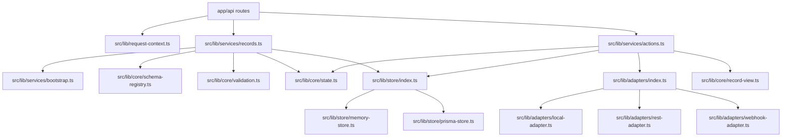
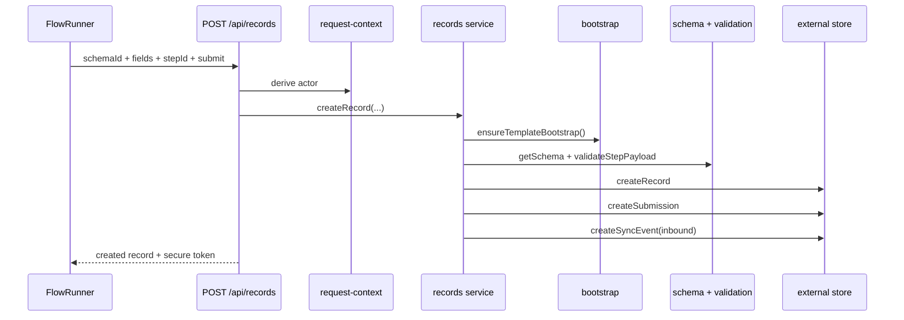
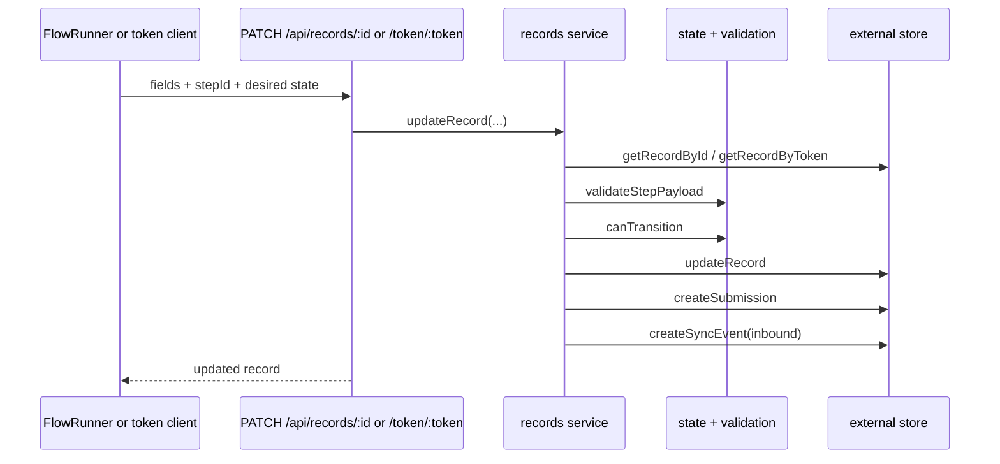
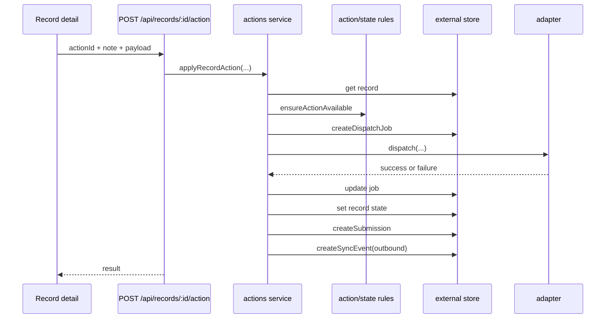

# Backend / Flow Map
**Project:** `apps/external_interaction_template`  
**Goal:** map the backend so behavior changes happen with intent instead of repo spelunking.

## 1. Backend mental model

The backend is organized around a pretty clean chain:

- route handlers receive requests
- request context resolves actor identity
- services apply business workflows
- core modules define schema/state/validation rules
- store layer persists records and workflow evidence
- adapters perform outbound integration work

This is good news because it means most changes have a natural first file to touch.

---

## 2. Backend dependency map

---

## 3. Backend control zones

## A. API entrypoints
### Files
- `app/api/records/route.ts`
- `app/api/records/[recordId]/route.ts`
- `app/api/records/[recordId]/actions/route.ts`
- `app/api/records/[recordId]/attachments/route.ts`
- `app/api/token/[token]/route.ts`
- `app/api/sync/*`

### Responsibility
- parse request input
- derive actor context
- call the correct service
- translate thrown errors to HTTP responses

### Touch this when
- request shape changes
- response shape changes
- access control needs route-level logic

### Risk
Medium. Good place for boundary logic, bad place for deep workflow rules.

---

## B. Request context / actor derivation
### File
- `src/lib/request-context.ts`

### Responsibility
- read `x-actor-role`
- read `x-authenticated`
- read `x-actor-id`
- read `x-actor-label`
- read `x-flow-token`
- normalize role into allowed actor values

### Touch this when
- access context changes
- you need new header-based identity metadata
- token behavior changes

### Risk
High. Small edits here change authorization flavor across many routes.

---

## C. Bootstrap / schema registration
### File
- `src/lib/services/bootstrap.ts`

### Responsibility
- ensure every schema in the registry exists in storage
- avoid duplicate bootstrapping within a process

### Key function
- `ensureTemplateBootstrap()`

### Touch this when
- adding initialization behavior
- adding storage-level schema metadata
- changing how startup registration works

### Risk
Medium. Safe if kept idempotent.

---

## D. Records service
### File
- `src/lib/services/records.ts`

### Responsibility
- list records
- get record by id
- get record by token
- create record
- update record
- add attachment metadata
- collect record subresources

### Important behavior
- calls `ensureTemplateBootstrap()`
- loads schema from registry
- validates the active step payload
- creates submissions
- creates inbound sync events
- issues secure tokens on create

### Touch this when
- create/update rules change
- submission lifecycle changes
- attachment metadata behavior changes
- inbound event behavior changes

### Risk
High. This is the main business workflow pipe.

---

## E. Actions service
### File
- `src/lib/services/actions.ts`

### Responsibility
- apply stateful actions like approve, reject, dispatch
- enforce action availability
- create dispatch jobs
- call adapters
- write outbound sync events
- retry failed jobs
- reconcile state after success/failure

### Touch this when
- approval behavior changes
- dispatch behavior changes
- retry logic changes
- sync status semantics change

### Risk
Very high. This is where workflow state and outbound integration shake hands.

---

## F. Core workflow rules
### Files
- `src/lib/core/schema-registry.ts`
- `src/lib/core/state.ts`
- `src/lib/core/validation.ts`
- `src/lib/core/visibility.ts`
- `src/lib/core/record-view.ts`
- `src/lib/core/types.ts`

### Responsibilities
#### `schema-registry.ts`
Defines the workflow universe:
- schemas
- steps
- fields
- actions
- views
- inbound/outbound adapter bindings

#### `state.ts`
Defines:
- legal state transitions
- action availability by role and state

#### `validation.ts`
Defines:
- per-step validation
- required fields
- coercion by field kind

#### `visibility.ts`
Defines:
- conditional field visibility
- role-based field visibility

#### `record-view.ts`
Defines:
- inbox sort behavior
- preview fields
- status labels / descriptions

### Touch this when
- product rules change
- schemas evolve
- field logic changes
- review logic changes

### Risk
Very high. These files are the backend constitution.

---

## G. Store layer
### Files
- `src/lib/store/index.ts`
- `src/lib/store/memory-store.ts`
- `src/lib/store/prisma-store.ts`
- `src/lib/store/types.ts`

### Responsibility
Abstract persistence behind a common store interface.

### Store selection
- `EXTERNAL_TEMPLATE_STORE=memory` -> memory store
- otherwise -> Prisma store

### Touch this when
- persistence behavior changes
- tests need different storage semantics
- audit data shape changes

### Risk
High. Easy place to create hidden regressions in data behavior.

---

## H. Adapter layer
### Files
- `src/lib/adapters/index.ts`
- `src/lib/adapters/local-adapter.ts`
- `src/lib/adapters/rest-adapter.ts`
- `src/lib/adapters/webhook-adapter.ts`
- `src/lib/adapters/transform.ts`
- `src/lib/adapters/types.ts`

### Responsibility
Handle outbound dispatch.

### Built-ins
- `local`
- `rest`
- `webhook`

### Behavior map
- `local` succeeds locally and stores payload-like response
- `rest` posts to `EXTERNAL_INTERACTION_REST_ENDPOINT`
- `webhook` posts to `EXTERNAL_INTERACTION_WEBHOOK_URL`

### Touch this when
- integration shape changes
- headers/payload mapping change
- you add a new external system adapter

### Risk
Medium to very high depending on environment coupling.

---

## 4. Data model map

### Prisma models
- `Actor`
- `RecordType`
- `ExternalRecord`
- `Submission`
- `Attachment`
- `DispatchJob`
- `SyncEvent`

### What they really mean

| Model | Purpose |
|---|---|
| `RecordType` | durable registration of schema definitions |
| `ExternalRecord` | the active workflow entity |
| `Submission` | every create/update/action payload event |
| `Attachment` | file metadata tied to a record |
| `DispatchJob` | outbound execution attempt state |
| `SyncEvent` | audit trail of inbound/outbound sync moments |
| `Actor` | optional person/system context |

### Safe mental model
`ExternalRecord` is the center of the galaxy.  
Everything else is orbiting evidence or transport state.

---

## 5. Real request flows

## A. Create record flow

---

## B. Update record flow

---

## C. Dispatch / action flow

---

## 6. If you want X, touch Y

| Goal | First file to touch | Second place to inspect |
|---|---|---|
| Add a new workflow/schema | `src/lib/core/schema-registry.ts` | `prisma/schema.prisma` only if persistence shape must change |
| Change state transitions | `src/lib/core/state.ts` | tests |
| Change validation rules | `src/lib/core/validation.ts` | `src/lib/core/visibility.ts` |
| Change create/update behavior | `src/lib/services/records.ts` | API route handlers |
| Change action/dispatch behavior | `src/lib/services/actions.ts` | adapter files |
| Change persistence implementation | `src/lib/store/prisma-store.ts` | `src/lib/store/types.ts` |
| Add new outbound integration | `src/lib/adapters/*` | `src/lib/adapters/index.ts` |
| Change actor/header model | `src/lib/request-context.ts` | affected API routes |
| Change attachment persistence | `app/api/records/[recordId]/attachments/route.ts` | `src/lib/services/records.ts` |

---

## 7. Backend danger zones

## `src/lib/core/state.ts`
One tiny state map edit can break approval/dispatch/retry flows.

## `src/lib/services/actions.ts`
This is where:
- role checks
- state checks
- dispatch jobs
- adapter responses
- sync events
all pile into one lane.

## `src/lib/store/prisma-store.ts`
Easy to create partial persistence drift here if payload serialization changes.

## `prisma/schema.prisma`
Schema edits are real migrations, not casual text changes.

## `src/lib/request-context.ts`
Header interpretation bugs can silently change who is allowed to do what.

---

## 8. README status and what is missing

The current README is solid for:
- scope
- stack
- included schemas
- local run commands
- API surface
- adapter model
- schema extension
- security/access model
- tests

What it does not currently document in a concrete way:
- frontend change map
- backend dependency / flow map
- change tracking
- rollback workflow
- managed docs section

That is why the injector in this bundle patches a managed README section instead of replacing the file.

---

## 9. Bottom line

If the question is:
- "Where do records actually get created/updated?" -> `src/lib/services/records.ts`
- "Where do actions and dispatch happen?" -> `src/lib/services/actions.ts`
- "Where are the workflow rules defined?" -> `src/lib/core/*`
- "Where is persistence decided?" -> `src/lib/store/index.ts`
- "Where do external systems get called?" -> `src/lib/adapters/*`
- "Where do HTTP requests enter?" -> `app/api/*`

That is the clean backend map for changing behavior without spelunking blind through the repo.
