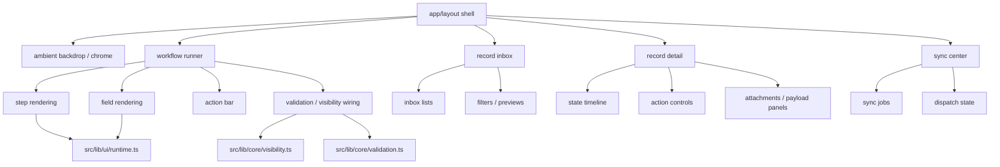

# Frontend Visual Map
**Project:** `apps/external_interaction_template`  
**Goal:** map the front-end surfaces so visual changes stop being blind cave diving.

## 1. Frontend mental model

This app is not a random pile of React files.
It has a clean front-end split:

- layout shell and ambient chrome
- workflow runner / schema-driven form runtime
- inbox / record detail surfaces
- sync center / operational surfaces
- UI runtime helpers and presentation glue

That means you can usually change visuals safely by starting with the surface layer first and only moving deeper if the change truly needs it.

---

## 2. Frontend control map

---

## 3. Where to touch for visual changes

## A. Global app shell / overall page framing
### Files
- `app/layout.tsx`
- `components/layout/app-shell.tsx`
- `components/layout/ambient-backdrop.tsx`

### Responsibility
- global spacing and shell composition
- ambient background / page atmosphere
- page-level framing and shared chrome

### Touch this when
- the app feels too cramped or too loose
- the overall page mood changes
- backdrop / polish / framing needs tuning

### Risk
Medium. Usually safe if you stay in styling and layout composition.

---

## B. Workflow runner surface
### Files
- `components/flow/flow-runner.tsx`
- `components/flow/step-panel.tsx`
- `components/flow/field-renderer.tsx`
- `components/flow/action-bar.tsx`

### Responsibility
- drives the main schema-based form UI
- renders steps, fields, action controls, progression
- holds the visual shape of the main interaction surface

### Touch this when
- the actual form flow needs visual changes
- step cards / field blocks / action buttons should look different
- progression UX changes

### Risk
Medium to high. Easy to affect usability if layout and runtime assumptions get crossed.

---

## C. Inbox surface
### Files
- `components/records/record-inbox.tsx`
- `components/records/inbox-list.tsx`
- `components/records/inbox-filters.tsx`

### Responsibility
- list and preview workflow records
- filter and sort inbox items
- display queue state to operators/reviewers

### Touch this when
- inbox density changes
- filter UX changes
- preview cards or list hierarchy should shift

### Risk
Medium. Mostly safe if you do not change data assumptions.

---

## D. Record detail surface
### Files
- `components/records/record-detail.tsx`
- `components/records/record-timeline.tsx`
- `components/records/record-actions.tsx`
- `components/records/attachments-panel.tsx`

### Responsibility
- display record state and history
- expose allowed actions
- show payload, attachments, sync or audit context

### Touch this when
- detail page hierarchy changes
- actions should be more or less prominent
- audit / attachment presentation changes

### Risk
Medium to high. Easy to create state/action confusion visually.

---

## E. Sync center / operational surfaces
### Files
- `components/sync/sync-center.tsx`
- `components/sync/dispatch-jobs-table.tsx`
- `components/sync/sync-events-panel.tsx`

### Responsibility
- display outbound dispatch jobs
- display inbound/outbound sync state
- expose operational status and retries

### Touch this when
- ops visibility changes
- dispatch states need clearer presentation
- retry/error views need improvement

### Risk
Medium. Mostly presentational, but can confuse debugging if labels become fuzzy.

---

## F. UI runtime glue
### Files
- `src/lib/ui/runtime.ts`
- `src/lib/ui/types.ts`

### Responsibility
- bridges schema definitions to actual rendered UI behavior
- maps field kinds, view rules, section structures, runtime helpers

### Touch this when
- field rendering rules change globally
- the same field kind should render differently everywhere
- runtime UI behavior must change at a structural level

### Risk
High. This is where “small visual tweak” can accidentally become “entire app behavior drift.”

---

## 4. If you want X, touch Y

| Goal | First file to touch | Second place to inspect |
|---|---|---|
| Change overall app atmosphere | `components/layout/ambient-backdrop.tsx` | `components/layout/app-shell.tsx` |
| Change global shell spacing/layout | `components/layout/app-shell.tsx` | `app/layout.tsx` |
| Change form step visuals | `components/flow/step-panel.tsx` | `components/flow/flow-runner.tsx` |
| Change field appearance | `components/flow/field-renderer.tsx` | `src/lib/ui/runtime.ts` |
| Change action button area | `components/flow/action-bar.tsx` | `components/records/record-actions.tsx` |
| Change inbox hierarchy | `components/records/record-inbox.tsx` | `components/records/inbox-list.tsx` |
| Change detail timeline/action layout | `components/records/record-detail.tsx` | `components/records/record-timeline.tsx` |
| Change sync / ops presentation | `components/sync/sync-center.tsx` | `components/sync/dispatch-jobs-table.tsx` |
| Change field-kind rendering globally | `src/lib/ui/runtime.ts` | `src/lib/ui/types.ts` |

---

## 5. Frontend danger zones

## `src/lib/ui/runtime.ts`
Affects multiple surfaces at once.

## `components/flow/field-renderer.tsx`
Tiny changes can ripple through every schema and step.

## `components/records/record-actions.tsx`
Can create visual mismatch between what users *see* and what backend rules actually allow.

## `components/layout/app-shell.tsx`
Can accidentally make everything worse at once if spacing or responsive framing drifts.

---

## 6. Safe change order

When changing the front-end, the safest order is:

1. surface component
2. child presentation component
3. shared UI runtime
4. only then deeper behavior glue

That order keeps changes local for as long as possible.

---

## 7. README status

The README is already decent for setup and feature coverage, but it does not explain:

- front-end control zones
- where visual changes should start
- which files are dangerous to edit casually
- how to avoid mixing UX changes with runtime rule changes

That is why this map exists.
