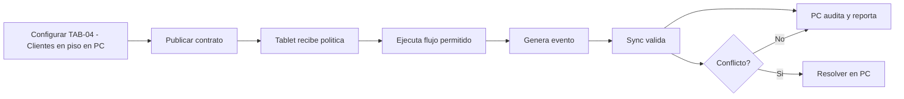

# TAB-04 - Clientes en piso

**Version:** 3.0.0  
**Perspectiva:** Tablet  
**Estado:** documento modular vivo  
**Regla madre:** crecer sin romper el core, sin secuestrar pantallas y sin meter logica de giro a martillazos.

## Proposito

Este documento define como PRISMA debe comportarse, extenderse y verificarse en la capa de interfaz y operacion. No es un adorno para sentirse profesional. Es una pieza de gobierno para que el sistema no termine convertido en una combi con aleron de Formula 1: vistosa, ruidosa y peligrosamente improvisada.

## Principios

1. **Core primero:** las verticales extienden, no reemplazan.
2. **PC gobierna:** configura, audita, reporta y resuelve.
3. **Tablet ejecuta:** opera rapido, claro, tactil y con tolerancia a fallas.
4. **Eventos siempre:** dinero, stock, cliente, caja, pedido, membresia, fiscal o produccion generan evento.
5. **Offline con reglas:** no todo se permite sin internet; lo permitido queda marcado, encolado y auditable.
6. **Plugin bajo contrato:** ningun plugin entra como primo incomodo a mover muebles sin avisar.
7. **Documento vivo:** todo cambio debe dejar rastro y compatibilidad.


## Contrato obligatorio de pantalla

| Campo | Requisito | Razon operacional |
|---|---|---|
| ID canonico | Obligatorio | Evita duplicados, alias raros y tragedias de versionado. |
| Intencion | Obligatorio | Define para que existe antes de decorarla con botones. |
| Owner | Obligatorio | Una cosa sin dueno termina siendo del diablo y del becario. |
| Modulos base | Obligatorio | Declara dependencias reales. |
| Slots de plugin | Obligatorio | Permite extensiones sin romper el corazon. |
| Permisos | Obligatorio | Si afecta dinero, inventario, cliente o caja, requiere permiso. |
| Eventos | Obligatorio | Lo que no genera evento casi no existio. |
| Offline | Obligatorio | Define que vive sin internet y que se bloquea. |
| Sync | Obligatorio | Declara cola, conflicto y reconciliacion. |
| Auditoria | Obligatorio | Debe decir quien hizo que, cuando, donde y desde que dispositivo. |
| Rollback | Obligatorio en cambios | Para no rezarle al santo patron de los deploys. |

### Invariantes de TAB-04 - Clientes en piso

- Ningun plugin escribe directamente sobre entidades canonicas sin pasar por contrato.
- Ninguna pantalla base se vuelve exclusiva de una vertical.
- Ningun flujo operativo queda mudo ante error, conflicto u offline.
- Toda accion sensible debe tener evento, permiso y rastro de auditoria.
- Todo cambio debe declarar reflejo PC <-> Tablet.





## Intencion

Esta pantalla existe para resolver una tarea concreta en Tablet. No debe volverse cajon de sastre ni vitrina de botones bonitos. La interfaz debe guiar al usuario hacia decision o ejecucion.

## Modulos base usados

| Modulo | Uso |
| reports | Participa en lectura, escritura o validacion de Clientes en piso. |
| sync | Participa en lectura, escritura o validacion de Clientes en piso. |
| sales | Participa en lectura, escritura o validacion de Clientes en piso. |
| orders | Participa en lectura, escritura o validacion de Clientes en piso. |
| settings | Participa en lectura, escritura o validacion de Clientes en piso. |

## Slots de plugin permitidos

| Slot | Uso permitido | Riesgo si se abusa |
| detail_panel | Extender Clientes en piso sin reemplazar el flujo base. | Secuestrar la pantalla y volverla vertical especifica. |
| context_action | Extender Clientes en piso sin reemplazar el flujo base. | Secuestrar la pantalla y volverla vertical especifica. |
| summary_card | Extender Clientes en piso sin reemplazar el flujo base. | Secuestrar la pantalla y volverla vertical especifica. |
| workflow_step | Extender Clientes en piso sin reemplazar el flujo base. | Secuestrar la pantalla y volverla vertical especifica. |
| validation_rule | Extender Clientes en piso sin reemplazar el flujo base. | Secuestrar la pantalla y volverla vertical especifica. |
| report_dimension | Extender Clientes en piso sin reemplazar el flujo base. | Secuestrar la pantalla y volverla vertical especifica. |

## Estados de interfaz

| Estado | Comportamiento esperado |
| vacio | Mostrar mensaje claro, accion siguiente y responsabilidad para vacio. |
| cargando | Mostrar mensaje claro, accion siguiente y responsabilidad para cargando. |
| error | Mostrar mensaje claro, accion siguiente y responsabilidad para error. |
| offline | Mostrar mensaje claro, accion siguiente y responsabilidad para offline. |
| sync_pendiente | Mostrar mensaje claro, accion siguiente y responsabilidad para sync_pendiente. |
| conflicto | Mostrar mensaje claro, accion siguiente y responsabilidad para conflicto. |
| degradado | Mostrar mensaje claro, accion siguiente y responsabilidad para degradado. |
| bloqueado | Mostrar mensaje claro, accion siguiente y responsabilidad para bloqueado. |

## Wireframe conceptual

```text
┌─────────────────────────────────────────────────────────────┐
│ TAB-04 Clientes en piso                                 │
├───────────────┬─────────────────────────────┬───────────────┤
│ Navegacion     │ Zona principal              │ Panel contexto │
│ modulo         │ datos / flujo / tabla        │ plugin / salud │
├───────────────┴─────────────────────────────┴───────────────┤
│ Barra estado: conexion · sync · permisos · auditoria         │
└─────────────────────────────────────────────────────────────┘
```

## Eventos

- `tab-04.opened`
- `tab-04.primary_action`
- `tab-04.plugin_action`
- `tab-04.sync_pending`
- `tab-04.error_reported`

## Permisos minimos

- `clientes-en-piso.view`
- `clientes-en-piso.execute`
- `clientes-en-piso.override`

## Relacion espejo

| En PC | En Tablet |
|---|---|
| Configura, audita o reporta esta capacidad. | Ejecuta, captura o consulta esta capacidad. |

## Riesgos

- Mezclar configuracion con ejecucion.
- Permitir accion offline sin politica.
- Ocultar errores de sync.
- Duplicar logica de plugin dentro de pantalla base.
