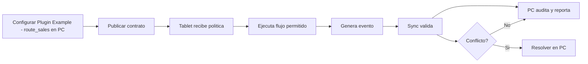

# Plugin Example - route_sales

**Version:** 3.0.0  
**Perspectiva:** plugin ejemplo  
**Estado:** documento modular vivo  
**Regla madre:** crecer sin romper el core, sin secuestrar pantallas y sin meter logica de giro a martillazos.

## Proposito

Este documento define como PRISMA debe comportarse, extenderse y verificarse en la capa de interfaz y operacion. No es un adorno para sentirse profesional. Es una pieza de gobierno para que el sistema no termine convertido en una combi con aleron de Formula 1: vistosa, ruidosa y peligrosamente improvisada.

## Principios

1. **Core primero:** las verticales extienden, no reemplazan.
2. **PC gobierna:** configura, audita, reporta y resuelve.
3. **Tablet ejecuta:** opera rapido, claro, tactil y con tolerancia a fallas.
4. **Eventos siempre:** dinero, stock, cliente, caja, pedido, membresia, fiscal o produccion generan evento.
5. **Offline con reglas:** no todo se permite sin internet; lo permitido queda marcado, encolado y auditable.
6. **Plugin bajo contrato:** ningun plugin entra como primo incomodo a mover muebles sin avisar.
7. **Documento vivo:** todo cambio debe dejar rastro y compatibilidad.

## Contrato obligatorio de pantalla

| Campo | Requisito | Razon operacional |
|---|---|---|
| ID canonico | Obligatorio | Evita duplicados, alias raros y tragedias de versionado. |
| Intencion | Obligatorio | Define para que existe antes de decorarla con botones. |
| Owner | Obligatorio | Una cosa sin dueno termina siendo del diablo y del becario. |
| Modulos base | Obligatorio | Declara dependencias reales. |
| Slots de plugin | Obligatorio | Permite extensiones sin romper el corazon. |
| Permisos | Obligatorio | Si afecta dinero, inventario, cliente o caja, requiere permiso. |
| Eventos | Obligatorio | Lo que no genera evento casi no existio. |
| Offline | Obligatorio | Define que vive sin internet y que se bloquea. |
| Sync | Obligatorio | Declara cola, conflicto y reconciliacion. |
| Auditoria | Obligatorio | Debe decir quien hizo que, cuando, donde y desde que dispositivo. |
| Rollback | Obligatorio en cambios | Para no rezarle al santo patron de los deploys. |

### Invariantes de Plugin Example - route_sales

- Ningun plugin escribe directamente sobre entidades canonicas sin pasar por contrato.
- Ninguna pantalla base se vuelve exclusiva de una vertical.
- Ningun flujo operativo queda mudo ante error, conflicto u offline.
- Toda accion sensible debe tener evento, permiso y rastro de auditoria.
- Todo cambio debe declarar reflejo PC <-> Tablet.

## ID

`plugin.route_sales`

## Pantallas PC afectadas

| Pantalla | Impacto |
| PC-04 | Configura, audita o reporta route_sales. |
| PC-03 | Configura, audita o reporta route_sales. |
| PC-08 | Configura, audita o reporta route_sales. |

## Pantallas Tablet afectadas

| Pantalla | Impacto |
| TAB-02 | Ejecuta o consulta route_sales. |
| TAB-04 | Ejecuta o consulta route_sales. |
| TAB-08 | Ejecuta o consulta route_sales. |

## Modulos extendidos

| Modulo | Uso |
| fiscal | Extension controlada para route_sales. |
| customers | Extension controlada para route_sales. |
| inventory | Extension controlada para route_sales. |
| sales | Extension controlada para route_sales. |

## Politica offline

- Permitido capturar si la cache esta vigente.
- Bloqueado confirmar si depende de validacion remota critica.
- Todo evento offline queda con `sync_status=pending`.
- Toda accion offline muestra folio local y advertencia humana.

## Politica de rollback

1. Suspender plugin.
2. Congelar nuevas acciones.
3. Mantener lectura historica.
4. Exportar eventos pendientes.
5. Reconciliar datos base sin eliminar entidades canonicas.

## Criterios de aceptacion

- Plugin se activa desde PC.
- Tablet muestra accion contextual solo con permiso.
- Error de plugin no tumba pantalla base.
- Auditoria muestra actor, dispositivo y entidad.
- Sync puede reintentar sin duplicar.
