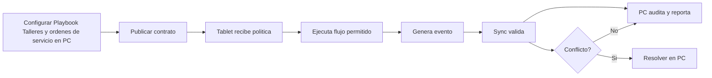

# Playbook Talleres y ordenes de servicio

**Version:** 3.0.0  
**Perspectiva:** playbook talleres-servicio  
**Estado:** documento modular vivo  
**Regla madre:** crecer sin romper el core, sin secuestrar pantallas y sin meter logica de giro a martillazos.

## Proposito

Este documento define como PRISMA debe comportarse, extenderse y verificarse en la capa de interfaz y operacion. No es un adorno para sentirse profesional. Es una pieza de gobierno para que el sistema no termine convertido en una combi con aleron de Formula 1: vistosa, ruidosa y peligrosamente improvisada.

## Principios

1. **Core primero:** las verticales extienden, no reemplazan.
2. **PC gobierna:** configura, audita, reporta y resuelve.
3. **Tablet ejecuta:** opera rapido, claro, tactil y con tolerancia a fallas.
4. **Eventos siempre:** dinero, stock, cliente, caja, pedido, membresia, fiscal o produccion generan evento.
5. **Offline con reglas:** no todo se permite sin internet; lo permitido queda marcado, encolado y auditable.
6. **Plugin bajo contrato:** ningun plugin entra como primo incomodo a mover muebles sin avisar.
7. **Documento vivo:** todo cambio debe dejar rastro y compatibilidad.

## Contrato obligatorio de pantalla

| Campo | Requisito | Razon operacional |
|---|---|---|
| ID canonico | Obligatorio | Evita duplicados, alias raros y tragedias de versionado. |
| Intencion | Obligatorio | Define para que existe antes de decorarla con botones. |
| Owner | Obligatorio | Una cosa sin dueno termina siendo del diablo y del becario. |
| Modulos base | Obligatorio | Declara dependencias reales. |
| Slots de plugin | Obligatorio | Permite extensiones sin romper el corazon. |
| Permisos | Obligatorio | Si afecta dinero, inventario, cliente o caja, requiere permiso. |
| Eventos | Obligatorio | Lo que no genera evento casi no existio. |
| Offline | Obligatorio | Define que vive sin internet y que se bloquea. |
| Sync | Obligatorio | Declara cola, conflicto y reconciliacion. |
| Auditoria | Obligatorio | Debe decir quien hizo que, cuando, donde y desde que dispositivo. |
| Rollback | Obligatorio en cambios | Para no rezarle al santo patron de los deploys. |

### Invariantes de Playbook Talleres y ordenes de servicio

- Ningun plugin escribe directamente sobre entidades canonicas sin pasar por contrato.
- Ninguna pantalla base se vuelve exclusiva de una vertical.
- Ningun flujo operativo queda mudo ante error, conflicto u offline.
- Toda accion sensible debe tener evento, permiso y rastro de auditoria.
- Todo cambio debe declarar reflejo PC <-> Tablet.

## Objetivo del playbook

Convertir la familia **Talleres y ordenes de servicio** en una implementacion comercial y tecnica sin romper el core de PRISMA.

## Secuencia de adopcion

| Fase | Objetivo | Evidencia |
| diagnostico | Cubrir diagnostico para Talleres y ordenes de servicio. | Documento, pantalla o evento verificable de diagnostico. |
| configuracion | Cubrir configuracion para Talleres y ordenes de servicio. | Documento, pantalla o evento verificable de configuracion. |
| operacion | Cubrir operacion para Talleres y ordenes de servicio. | Documento, pantalla o evento verificable de operacion. |
| auditoria | Cubrir auditoria para Talleres y ordenes de servicio. | Documento, pantalla o evento verificable de auditoria. |
| reportes | Cubrir reportes para Talleres y ordenes de servicio. | Documento, pantalla o evento verificable de reportes. |
| expansion | Cubrir expansion para Talleres y ordenes de servicio. | Documento, pantalla o evento verificable de expansion. |

## Caso narrativo

Un negocio de esta familia no compra software porque tenga ganas de aprender modulos. Compra control. Compra menos error. Compra no depender de que una persona se acuerde de todo. La interfaz debe hablar ese idioma: acciones claras, estados claros y consecuencias claras.

## Paquete minimo vendible

- Configuracion base en PC.
- Operacion principal en Tablet.
- Permisos por rol.
- Eventos auditables.
- Reporte basico.
- Modo degradado.
- Checklist de piloto.

## Checklist de piloto

- [ ] Caso 1: validar reparacion celular con modulo payments, evento auditable y rollback documentado.
- [ ] Caso 2: validar taller mecanico con modulo settings, evento auditable y rollback documentado.
- [ ] Caso 3: validar computo con modulo sync, evento auditable y rollback documentado.
- [ ] Caso 4: validar electrodomesticos con modulo sales, evento auditable y rollback documentado.
- [ ] Caso 5: validar motos con modulo sales, evento auditable y rollback documentado.
- [ ] Caso 6: validar taller mecanico con modulo customers, evento auditable y rollback documentado.
- [ ] Caso 7: validar computo con modulo reports, evento auditable y rollback documentado.
- [ ] Caso 8: validar taller mecanico con modulo inventory, evento auditable y rollback documentado.
- [ ] Caso 9: validar reparacion celular con modulo hardware, evento auditable y rollback documentado.
- [ ] Caso 10: validar reparacion celular con modulo hardware, evento auditable y rollback documentado.
- [ ] Caso 11: validar taller mecanico con modulo inventory, evento auditable y rollback documentado.
- [ ] Caso 12: validar electrodomesticos con modulo settings, evento auditable y rollback documentado.
- [ ] Caso 13: validar motos con modulo sync, evento auditable y rollback documentado.
- [ ] Caso 14: validar mantenimiento ligero con modulo sales, evento auditable y rollback documentado.
- [ ] Caso 15: validar reparacion celular con modulo settings, evento auditable y rollback documentado.

## Preguntas para venta

- Que proceso se sigue haciendo a mano?
- Que pasa cuando no hay internet?
- Quien autoriza descuentos o credito?
- Que dato se pierde mas seguido?
- Que reporte pide el dueno cada semana?
- Que flujo da mas pena explicar?
