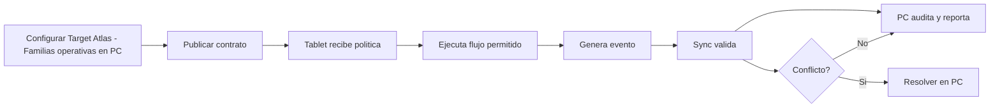

# Target Atlas - Familias operativas

**Version:** 3.0.0  
**Perspectiva:** plugins  
**Estado:** documento modular vivo  
**Regla madre:** crecer sin romper el core, sin secuestrar pantallas y sin meter logica de giro a martillazos.

## Proposito

Este documento define como PRISMA debe comportarse, extenderse y verificarse en la capa de interfaz y operacion. No es un adorno para sentirse profesional. Es una pieza de gobierno para que el sistema no termine convertido en una combi con aleron de Formula 1: vistosa, ruidosa y peligrosamente improvisada.

## Principios

1. **Core primero:** las verticales extienden, no reemplazan.
2. **PC gobierna:** configura, audita, reporta y resuelve.
3. **Tablet ejecuta:** opera rapido, claro, tactil y con tolerancia a fallas.
4. **Eventos siempre:** dinero, stock, cliente, caja, pedido, membresia, fiscal o produccion generan evento.
5. **Offline con reglas:** no todo se permite sin internet; lo permitido queda marcado, encolado y auditable.
6. **Plugin bajo contrato:** ningun plugin entra como primo incomodo a mover muebles sin avisar.
7. **Documento vivo:** todo cambio debe dejar rastro y compatibilidad.

## Contrato obligatorio de pantalla

| Campo | Requisito | Razon operacional |
|---|---|---|
| ID canonico | Obligatorio | Evita duplicados, alias raros y tragedias de versionado. |
| Intencion | Obligatorio | Define para que existe antes de decorarla con botones. |
| Owner | Obligatorio | Una cosa sin dueno termina siendo del diablo y del becario. |
| Modulos base | Obligatorio | Declara dependencias reales. |
| Slots de plugin | Obligatorio | Permite extensiones sin romper el corazon. |
| Permisos | Obligatorio | Si afecta dinero, inventario, cliente o caja, requiere permiso. |
| Eventos | Obligatorio | Lo que no genera evento casi no existio. |
| Offline | Obligatorio | Define que vive sin internet y que se bloquea. |
| Sync | Obligatorio | Declara cola, conflicto y reconciliacion. |
| Auditoria | Obligatorio | Debe decir quien hizo que, cuando, donde y desde que dispositivo. |
| Rollback | Obligatorio en cambios | Para no rezarle al santo patron de los deploys. |

### Invariantes de Target Atlas - Familias operativas

- Ningun plugin escribe directamente sobre entidades canonicas sin pasar por contrato.
- Ninguna pantalla base se vuelve exclusiva de una vertical.
- Ningun flujo operativo queda mudo ante error, conflicto u offline.
- Toda accion sensible debe tener evento, permiso y rastro de auditoria.
- Todo cambio debe declarar reflejo PC <-> Tablet.

## Familias

| ID | Familia | Ejemplos | Doc |
| retail-transaccional | Retail transaccional | abarrotes, minisuper, boutique, papeleria | [retail-transaccional](retail-transaccional.md) |
| retail-tecnico | Retail tecnico especializado | ferreteria, refaccionaria, tlapaleria, autopartes | [retail-tecnico](retail-tecnico.md) |
| perecederos-lotes | Perecederos, lotes y control sanitario | farmacia, cremeria, carniceria, panaderia | [perecederos-lotes](perecederos-lotes.md) |
| hospitality-alimentos | Hospitality y alimentos | restaurante, cafeteria, dark kitchen, fonda | [hospitality-alimentos](hospitality-alimentos.md) |
| membresias-acceso | Membresias, acceso y recurrencia | gym, estudio fitness, club, coworking | [membresias-acceso](membresias-acceso.md) |
| servicios-agenda | Servicios con agenda | barberia, salon belleza, spa, clinica estetica | [servicios-agenda](servicios-agenda.md) |
| talleres-servicio | Talleres y ordenes de servicio | taller mecanico, reparacion celular, computo, motos | [talleres-servicio](talleres-servicio.md) |
| maquila-produccion | Maquila, produccion ligera y pedidos | maquila textil, bordado, sublimacion, carpinteria ligera | [maquila-produccion](maquila-produccion.md) |
| distribucion-rutas | Distribucion, rutas y preventa | reparto, garrafones, preventa, mayorista local | [distribucion-rutas](distribucion-rutas.md) |
| b2b-cartera | B2B, credito y cartera | mayoreo, proveedor comercial, insumos empresariales, contratistas | [b2b-cartera](b2b-cartera.md) |
| renta-activos | Renta, reservas y activos | maquinaria, vestidos, mobiliario, herramientas | [renta-activos](renta-activos.md) |
| educacion-cursos | Educacion y cursos | academia, idiomas, capacitacion tecnica, clases extracurriculares | [educacion-cursos](educacion-cursos.md) |
| salud-admin | Salud administrativa no clinica | optica, dental administrativo, laboratorio administrativo, veterinaria | [salud-admin](salud-admin.md) |
| agro-campo | Agro, veterinaria y campo | agroinsumos, alimento animal, semillas, fertilizantes | [agro-campo](agro-campo.md) |
| eventos-temporal | Eventos y operacion temporal | feria, bazar, stand, concierto | [eventos-temporal](eventos-temporal.md) |
| franquicia-multisucursal | Franquicia ligera y multisucursal | cadena pequena, franquicia emergente, grupo restaurantero, red local | [franquicia-multisucursal](franquicia-multisucursal.md) |

## Uso correcto

No preguntes "sirve para gym". Pregunta que patron operativo tiene el negocio: membresia, agenda, inventario, pedidos, cartera, rutas, produccion, fiscal, hardware, offline. Esa pregunta evita que PRISMA se vuelva una feria de pantallas especificas.
