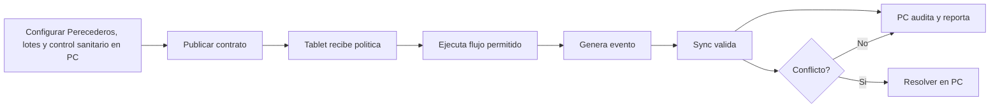

# Perecederos, lotes y control sanitario

**Version:** 3.0.0  
**Perspectiva:** familia perecederos-lotes  
**Estado:** documento modular vivo  
**Regla madre:** crecer sin romper el core, sin secuestrar pantallas y sin meter logica de giro a martillazos.

## Proposito

Este documento define como PRISMA debe comportarse, extenderse y verificarse en la capa de interfaz y operacion. No es un adorno para sentirse profesional. Es una pieza de gobierno para que el sistema no termine convertido en una combi con aleron de Formula 1: vistosa, ruidosa y peligrosamente improvisada.

## Principios

1. **Core primero:** las verticales extienden, no reemplazan.
2. **PC gobierna:** configura, audita, reporta y resuelve.
3. **Tablet ejecuta:** opera rapido, claro, tactil y con tolerancia a fallas.
4. **Eventos siempre:** dinero, stock, cliente, caja, pedido, membresia, fiscal o produccion generan evento.
5. **Offline con reglas:** no todo se permite sin internet; lo permitido queda marcado, encolado y auditable.
6. **Plugin bajo contrato:** ningun plugin entra como primo incomodo a mover muebles sin avisar.
7. **Documento vivo:** todo cambio debe dejar rastro y compatibilidad.

## Contrato obligatorio de pantalla

| Campo | Requisito | Razon operacional |
|---|---|---|
| ID canonico | Obligatorio | Evita duplicados, alias raros y tragedias de versionado. |
| Intencion | Obligatorio | Define para que existe antes de decorarla con botones. |
| Owner | Obligatorio | Una cosa sin dueno termina siendo del diablo y del becario. |
| Modulos base | Obligatorio | Declara dependencias reales. |
| Slots de plugin | Obligatorio | Permite extensiones sin romper el corazon. |
| Permisos | Obligatorio | Si afecta dinero, inventario, cliente o caja, requiere permiso. |
| Eventos | Obligatorio | Lo que no genera evento casi no existio. |
| Offline | Obligatorio | Define que vive sin internet y que se bloquea. |
| Sync | Obligatorio | Declara cola, conflicto y reconciliacion. |
| Auditoria | Obligatorio | Debe decir quien hizo que, cuando, donde y desde que dispositivo. |
| Rollback | Obligatorio en cambios | Para no rezarle al santo patron de los deploys. |

### Invariantes de Perecederos, lotes y control sanitario

- Ningun plugin escribe directamente sobre entidades canonicas sin pasar por contrato.
- Ninguna pantalla base se vuelve exclusiva de una vertical.
- Ningun flujo operativo queda mudo ante error, conflicto u offline.
- Toda accion sensible debe tener evento, permiso y rastro de auditoria.
- Todo cambio debe declarar reflejo PC <-> Tablet.

## Targets incluidos

| Target | Dolor operativo | Modulo dominante | Plugin sugerido |
| farmacia | Operacion de farmacia con reglas particulares, excepciones humanas y necesidad de trazabilidad. | procurement | farmacia_extension |
| cremeria | Operacion de cremeria con reglas particulares, excepciones humanas y necesidad de trazabilidad. | hardware | cremeria_extension |
| carniceria | Operacion de carniceria con reglas particulares, excepciones humanas y necesidad de trazabilidad. | sales | carniceria_extension |
| panaderia | Operacion de panaderia con reglas particulares, excepciones humanas y necesidad de trazabilidad. | settings | panaderia_extension |
| fruteria | Operacion de fruteria con reglas particulares, excepciones humanas y necesidad de trazabilidad. | orders | fruteria_extension |
| veterinaria con inventario | Operacion de veterinaria con inventario con reglas particulares, excepciones humanas y necesidad de trazabilidad. | sync | veterinaria-con-inventario_extension |

## Modulos normalmente involucrados

| Modulo | Uso |
| sales | Soporta el patron Perecederos, lotes y control sanitario y debe conservar contrato compartido. |
| orders | Soporta el patron Perecederos, lotes y control sanitario y debe conservar contrato compartido. |
| inventory | Soporta el patron Perecederos, lotes y control sanitario y debe conservar contrato compartido. |
| catalog | Soporta el patron Perecederos, lotes y control sanitario y debe conservar contrato compartido. |
| hardware | Soporta el patron Perecederos, lotes y control sanitario y debe conservar contrato compartido. |
| procurement | Soporta el patron Perecederos, lotes y control sanitario y debe conservar contrato compartido. |
| sync | Soporta el patron Perecederos, lotes y control sanitario y debe conservar contrato compartido. |
| settings | Soporta el patron Perecederos, lotes y control sanitario y debe conservar contrato compartido. |

## Plugins candidatos

| Plugin | Tipo | Notas |
| farmacia_plugin | vertical | farmacia_plugin debe declarar permisos, eventos, offline, sync y rollback. |
| cremeria_plugin | vertical | cremeria_plugin debe declarar permisos, eventos, offline, sync y rollback. |
| carniceria_plugin | vertical | carniceria_plugin debe declarar permisos, eventos, offline, sync y rollback. |
| panaderia_plugin | vertical | panaderia_plugin debe declarar permisos, eventos, offline, sync y rollback. |
| fruteria_plugin | vertical | fruteria_plugin debe declarar permisos, eventos, offline, sync y rollback. |
| perecederos-lotes_core_pack | vertical | perecederos-lotes_core_pack debe declarar permisos, eventos, offline, sync y rollback. |
| perecederos-lotes_report_pack | vertical | perecederos-lotes_report_pack debe declarar permisos, eventos, offline, sync y rollback. |

## Flujo comercial base

1. Identificar cliente o consumidor.
2. Seleccionar producto, servicio, pedido, membresia, ruta o activo.
3. Validar reglas de precio, stock, agenda, cartera o disponibilidad.
4. Ejecutar cobro, apartado, orden, entrega o avance.
5. Generar evento.
6. Encolar sync si hace falta.
7. Auditar en PC.

## Riesgos tipicos

- Querer crear pantalla nueva en lugar de plugin.
- Mezclar reglas fiscales con reglas operativas.
- Permitir offline sin cache valida.
- Duplicar cliente, producto o pedido por vertical.

## Demo vendible

La demo debe mostrar un caso cotidiano, un problema real y una solucion visible. Nada de explicar arquitectura como si el cliente hubiera pedido clase de ingeniería. Se muestra dolor, control y resultado.
