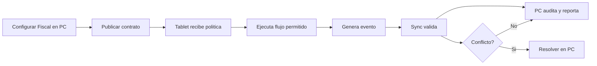

# Fiscal

**Version:** 3.0.0  
**Perspectiva:** modulo fiscal  
**Estado:** documento modular vivo  
**Regla madre:** crecer sin romper el core, sin secuestrar pantallas y sin meter logica de giro a martillazos.

## Proposito

Este documento define como PRISMA debe comportarse, extenderse y verificarse en la capa de interfaz y operacion. No es un adorno para sentirse profesional. Es una pieza de gobierno para que el sistema no termine convertido en una combi con aleron de Formula 1: vistosa, ruidosa y peligrosamente improvisada.

## Principios

1. **Core primero:** las verticales extienden, no reemplazan.
2. **PC gobierna:** configura, audita, reporta y resuelve.
3. **Tablet ejecuta:** opera rapido, claro, tactil y con tolerancia a fallas.
4. **Eventos siempre:** dinero, stock, cliente, caja, pedido, membresia, fiscal o produccion generan evento.
5. **Offline con reglas:** no todo se permite sin internet; lo permitido queda marcado, encolado y auditable.
6. **Plugin bajo contrato:** ningun plugin entra como primo incomodo a mover muebles sin avisar.
7. **Documento vivo:** todo cambio debe dejar rastro y compatibilidad.

## Contrato obligatorio de pantalla

| Campo | Requisito | Razon operacional |
|---|---|---|
| ID canonico | Obligatorio | Evita duplicados, alias raros y tragedias de versionado. |
| Intencion | Obligatorio | Define para que existe antes de decorarla con botones. |
| Owner | Obligatorio | Una cosa sin dueno termina siendo del diablo y del becario. |
| Modulos base | Obligatorio | Declara dependencias reales. |
| Slots de plugin | Obligatorio | Permite extensiones sin romper el corazon. |
| Permisos | Obligatorio | Si afecta dinero, inventario, cliente o caja, requiere permiso. |
| Eventos | Obligatorio | Lo que no genera evento casi no existio. |
| Offline | Obligatorio | Define que vive sin internet y que se bloquea. |
| Sync | Obligatorio | Declara cola, conflicto y reconciliacion. |
| Auditoria | Obligatorio | Debe decir quien hizo que, cuando, donde y desde que dispositivo. |
| Rollback | Obligatorio en cambios | Para no rezarle al santo patron de los deploys. |

### Invariantes de Fiscal

- Ningun plugin escribe directamente sobre entidades canonicas sin pasar por contrato.
- Ninguna pantalla base se vuelve exclusiva de una vertical.
- Ningun flujo operativo queda mudo ante error, conflicto u offline.
- Toda accion sensible debe tener evento, permiso y rastro de auditoria.
- Todo cambio debe declarar reflejo PC <-> Tablet.

## Responsabilidades

| Capacidad | Tipo | Notas |
| cfdi | base | cfdi debe exponer eventos y permisos propios. |
| tickets | base | tickets debe exponer eventos y permisos propios. |
| notas | base | notas debe exponer eventos y permisos propios. |
| timbrado | extendible | timbrado debe exponer eventos y permisos propios. |
| intentos | extendible | intentos debe exponer eventos y permisos propios. |
| auditoria fiscal | extendible | auditoria fiscal debe exponer eventos y permisos propios. |

## Slots de plugin sugeridos

- `before_create`
- `after_create`
- `before_commit`
- `after_commit`
- `detail_panel`
- `summary_card`
- `context_action`
- `report_dimension`

## Eventos minimos

- `fiscal.created`
- `fiscal.updated`
- `fiscal.approved`
- `fiscal.cancelled`
- `fiscal.sync_pending`
- `fiscal.sync_conflict`

## Pruebas de salud

- Crear entidad basica.
- Editar entidad con permiso valido.
- Intentar editar sin permiso y bloquear con mensaje humano.
- Ejecutar offline si aplica.
- Reconciliar sync.
- Validar auditoria en PC.
