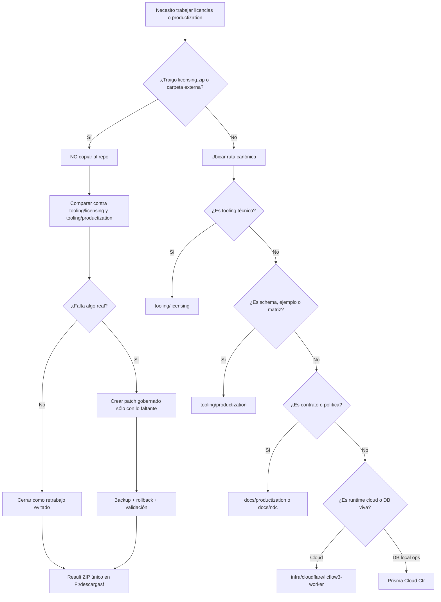
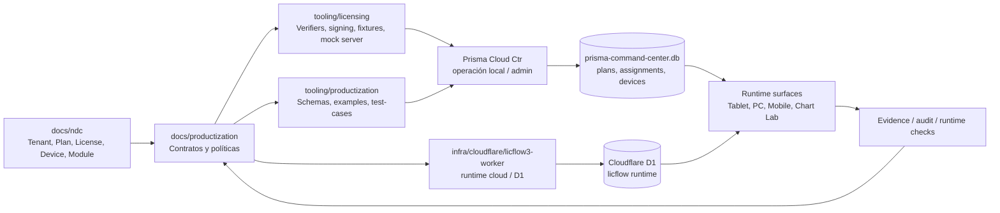

# PRISMA Licensing / Productization Flow

Estado: canon operativo documentado
Fecha aproximada: 2026-07-10T10:01:18
Modo: anti-retrabajo, anti-duplicación, testing-first

## Veredicto corto

No copiar `licensing.zip` otra vez dentro de `tooling`.

El ZIP histórico ya está representado por el canon vivo del repo. Si alguien vuelve a traer `licensing.zip`, primero se compara contra el repo. No se instala a ciegas.

## Rutas canónicas

| Responsabilidad | Ruta canónica |
|---|---|
| Tooling técnico de licencias | `F:\repos\hitech-os\apps\terminal-de-venta-system\tooling\licensing` |
| Productización, schemas, ejemplos y matrices | `F:\repos\hitech-os\apps\terminal-de-venta-system\tooling\productization` |
| Contratos y políticas | `F:\repos\hitech-os\apps\terminal-de-venta-system\docs\productization` |
| Scope neutral, tenant, plan, license, device, module | `F:\repos\hitech-os\apps\terminal-de-venta-system\docs\ndc` |
| Runtime cloud / Licflow | `F:\repos\hitech-os\apps\terminal-de-venta-system\infra\cloudflare\licflow3-worker` |
| Operación viva local / Cloud Center | `F:\repos\hitech-os\apps\terminal-de-venta-system\Prisma Cloud Ctr` |
| Schema base cuando aplique | `F:\repos\hitech-os\apps\terminal-de-venta-system\prisma` |

## Semáforo

| Estado | Significado |
|---|---|
| Verde | Docs, schemas, fixtures, examples, migraciones y baseline estático pasaron sin FAIL. |
| Amarillo | Runtime real, Cloudflare/D1, secretos, keys y endpoints requieren env o prueba explícita. |
| Rojo | Copiar `licensing.zip` encima de `tooling`, borrar fixtures duplicados, mover carpetas sin Mesh. |

## Resultado de auditoría disponible

- `liccanon`: canon review read-only.
- `licmesh`: Mesh de autoridad read-only para licensing/productization.
- `lictest`: 350 archivos probados, 0 FAIL.
- `licfine`: 27 archivos finos probados, 0 FAIL, 1 warning CSS por `!important`.

Esto NO es certificación de producción. Es baseline sano para no volver a duplicar tooling.

## Flujo anti-error



## Flujo de datos esperado



## Reglas anti-retrabajo

1. Si aparece `licensing.zip`, no se copia.
2. Primero se compara por hash y rutas.
3. `tooling/licensing` manda para tooling técnico.
4. `tooling/productization` manda para examples, schemas y test-cases.
5. `docs/productization` manda para contratos.
6. `docs/ndc` manda para significado neutral: tenant, plan, license, device, entitlement, surface.
7. `Prisma Cloud Ctr` y `infra/cloudflare/licflow3-worker` son runtime/data boundary, no carpeta de ejemplos.
8. No borrar duplicados de fixtures sin demostrar si son compatibilidad, ejemplo comercial o test técnico.
9. No declarar producción por pasar static tests.
10. Todo cambio real requiere backup, rollback, validación y ZIP único final.

## Dónde va cada cosa

```text
Tooling técnico de licencia        -> tooling/licensing
Schemas, examples, test-cases      -> tooling/productization
Contratos, políticas, runbooks     -> docs/productization
Scope neutral / tenant / module    -> docs/ndc
Cloud runtime / D1 / worker        -> infra/cloudflare/licflow3-worker
DB local operativa                 -> Prisma Cloud Ctr
```

Si no cae limpio en una ruta, no lo copies. Genera Mesh o canon review.
