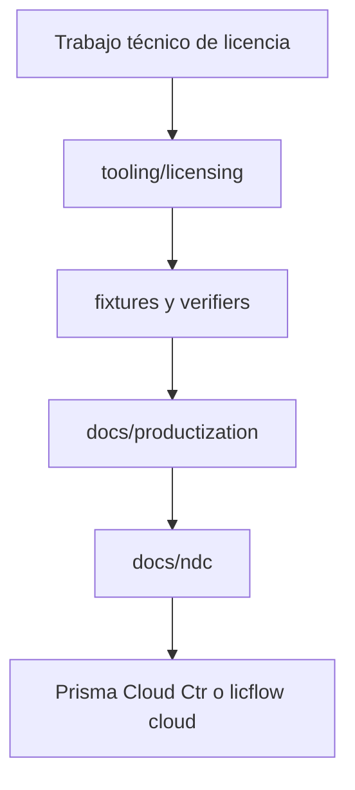

<!-- PRISMA_LICENSING_CANON_GUARD:START -->
# PRISMA Licensing Tooling

Este directorio es el canon técnico para herramientas locales de licenciamiento.

## No hacer

- No copiar `licensing.zip` encima de esta carpeta.
- No borrar fixtures duplicados sin clasificar su función.
- No mover módulos `server06`, `device08`, `keys09`, `signature10`, `server11` o `server11d` sólo por parecer viejos.
- No ejecutar scripts contra producción sin leer contrato/env/keys.

## Hacer

- Usar esta carpeta para verifiers, signing, mock server, fixtures técnicos y políticas de prueba.
- Usar `tooling/productization` para schemas, examples, matrices y casos de producto.
- Usar `docs/productization/PRISMA_LICENSE_PRODUCTIZATION_FLOW.md` como mapa de flujo.
- Usar `docs/ndc` para significado neutral: tenant, plan, license, device, module, entitlement.

## Flujo mínimo

Última actualización por paquete: `licdoc3 1007 1001`.
<!-- PRISMA_LICENSING_CANON_GUARD:END -->
